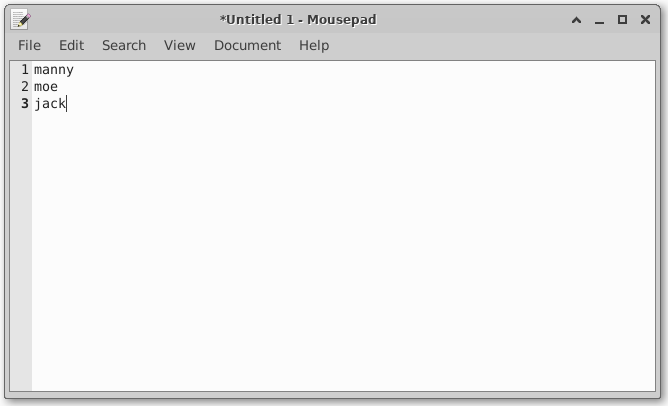

# CPSC 120-10 - Lab 11 - Instructions

This week we're going to work on loops a bit more, and dip our toes into file storage.

## Part 1 - Accepting Input from the Command Line

The first thing we'll do is quickly learn how to receive input from the command line. This part is instructional only, and won't require any coding from you.

### Review - Passing Arguments on the Command Line

You'll recall we've been sending input to certain programs through the command line, such as ```git```:

```bash
$ git status
$ git commit -a
$ git push
```

In the above snippet, the ```git``` part is considered the program, while the ```status```, ```commit```, ```-a```, and ```push``` parts are all considered arguments we send into ```git```.

Thus far, the programs we've been writing haven't accepted any arguments. Recall that we usually execute our programs in a way similar to the following:

```bash
$ cd /path/to/repo
$ make
$ ./my-lab-whatever.bin
```

Now, we'll start learning how to write our programs to accept input from the command line. For this lab, we want to accept one argument - the name of a file. Here's a preview of what that might generally look like:

```bash
$ cd /path/to/repo
$ make
$ ./my-lab-whatever.bin "names.db"
```

More explanation follows in the next section.

### A Different main() Signature

Thus far we've only used a simple version of our ```main``` function, which takes no arguments and returns an integer. You'll recognize the following code from literally every lecture and lab we've ever done this entire semester:

```cpp

int main()
{
	return 0;
}

```

But as we've discussed before, there are other forms of ```main``` we can use. For example, a ```main``` that doesn't return any value would look like this:

```cpp

void main()
{
	
}

```

For this lab, let's use a slightly more complex form of ```main``` that will allow us to pass arguments from the command line directly into our program! It looks like this:

```cpp

int main(int argc, char *argv[])
{
	return 0;
}

```

This new function signature may look strange, but is quite simple. Before we go any further we should keep in mind there is overlapping terminology that may seem confusing at first:

* When we pass arguments to our program through the command line, we are passing in *command line arguments*.

* When we receive variables through our ```main``` function's parameters (```argc``` and ```argv```), we are receiving *function arguments*.

* Those two things are different, but are often both simply called *arguments*.

* Keep this in mind and try not to let the overlapping terminology confuse you. When communicating with classmates, you may wish to clarify by using the full term for each, instead of just the word *arguments*.

So anyway, let's examine the meaning of these arguments ;)

### The Meaning of argc and argv

First the ```argc``` argument tells us *how many* command line arguments our program has been sent. You can remember that ```argc``` is short for *Argument Count*.

The second argument ```argv``` holds an array of cstrings, (also known as an array of character arrays). Each cstring represents one argument. Thus, you can check the number of arguments given to your program on the command line, as well as access them, like so:

```cpp

#include <iostream>
using std::cout, std::endl;
int main(int argc, char *argv[])
{
	//
	if ( argc >= 3 ) {
		cout << "The first argument (index 0) is: " << argv[0] << endl;
		cout << "The second argument (index 1) is: " << argv[1] << endl;
		cout << "The third argument (index 2) is: " << argv[2] << endl;
	}
	else {
		cout << "Didn't find enough arguments to print what I wanted to print!";
	}
	return 0;
}

```

Suppose we run the above program with the following:

```bash
$ cd /path/to/repo
$ ./my-lab-whatever.bin one two
```

We would then see the following output:

```text

The first argument (index 0) is: ./my-lab-whatever.bin
The second argument (index 1) is: one
The third argument (index 2) is: two

```

### Things to Remember

There are some things you should remember:

1. The first argument (argument at index 0, which is ```argv[0]```) always contains the path to your program's executable. No matter what you provide on the command line, this first argument will always be the same.

2. Each further argument starts at index 1, which is accessed through ```argv[1]```. Additional arguments use increasing index numbers.

3. The ```argc``` and ```argv``` arguments are actually just normal function arguments. Thus, your program can access these arguments simply by using them like any other variable within the ```main``` scope.

4. Because the ```argc``` variable is a *count*, but the ```argv``` variable is an array (which uses [zero-based indexing](https://medium.com/swlh/zero-indexed-arrays-f752a47abf65)), the numbers won't match in an immediately-intuitive way if you're new to coding. For example, suppose the following:

	* Your program receives 2 arguments on the command line.

	* Including the path to your program's executable at ```argv[0]```, your program will see a total of 3 arguments.

	* The ```argc``` variable will be 3

	* The ```argv``` variable will be valid at the following indexes: ```argv[0]```, ```argv[1]```, and ```argv[2]```.

	* Notice how 3 is not 2?

5. You always want to check ```argc``` for the number of incoming arguments. Don't just assume your user has inputted the correct number of arguments; If you attempt to access an invalid index of ```argv```, your program will probably crash. Check the above code again and it might make more sense, now.

## Part 2 - Another Menu-Driven Program

Now let's write our actual program

### Setting Up Your Program

Start a program with the following:

* Your program's Makefile target should be named *lab11-main*, and execute by default

* Your program's executable name should be: *lab11.bin*

* Your program's source file should be: *main.cpp*

***Note***: For this program and all further programs throughout this semester, use the new signature for ```main``` that can accept command line arguments. Expect that you may be asked in the future to "do XYZ with the first argument passed into your program".

### Opening the File

When your program first starts, it should open an ```ofstream``` object to a file for output. The name of the file should be taken from the *first command line argument* received by your program. When [opening](https://www.cplusplus.com/reference/fstream/ofstream/open/) this file, use text mode and truncate mode. *Hint*: Text mode is already used by default.

For example, suppose the user launches your program like so:

```bash

$ cd /path/to/repo
$ make
$ ./lab11.bin "lol.db"

```

Your program would assign "lol.db" (or whatever was present as the first argument) to a variable, then use that variable to specify the file name when opening your ```ofstream``` object.

This is the file object you should use whenever you need to write to a file, as mentioned elsewhere in this lab document.

If the user hasn't provided any command line arguments (thus you have no file name), your program should throw an exception, like so:

```cpp
throw std::runtime_error("No input filename found; Please provide one as the first argument when invoking this program!");
```

You may also notice that the usual ```make``` command doesn't seem to work with command line arguments:

```bash

$ make "some_file_name.db"

make: *** No rule to make target 'some_file_name.db'.  Stop.

```

This happens because ```make``` is gobbling up all the arguments for itself. Instead, you'll have to modify your Makefile:

1. Create a new variable in your Makefile called DEFAULT_DATAFILE_NAME
2. Adjust your *lab11-main* target to pass that variable as an argument to your program.

For example, your Makefile probably usually looks something like this:

```make

#	Launch/Run the main executable
lab11-main:	$(EXE_PATH)
	@echo "Executing main executable"
	$(EXE_PATH)

```

Instead, try this:

```make

DEFAULT_DATAFILE_NAME := names.db

#	Launch/Run the main executable
lab11-main:	$(EXE_PATH)
	@echo "Executing main executable"
	$(EXE_PATH) "$(DEFAULT_DATAFILE_NAME)"

```

### A Very Simple Main Menu

Next, create a main menu for your program. The menu should have two options and look like this:

```text

*** Main Menu ***

1. Record some names
Q. Quit

```

The loop in charge of your menu's lifespan should be a *do while* loop, not a regular ```while``` loop and should not contain any ```break``` statements. You may use ```if```, ```else if```, and ```else``` statements to control your code here; Don't use any ```switch``` statements for this lab.

Before reading the user's input with ```cin```, call ```cin.clear();``` to make sure the input is flushed to avoid infinite loops on certain types of bad input.

When the user enters a valid choice, your program should announce what it is about to do.

If the user's input is invalid, your program should complain and show the menu again, but not exit the menu loop. The complaint should read: ***Invalid choice!***

When the main menu loop eventually finishes, your program should say goodbye to the user and exit by letting execution fall down to the usual ```return 0``` statement inside ```main```.

Each menu option should behave according to the following descriptions.

#### Choice 1 - Recording Some Names

When the user enters a *1* in the main menu, your program should ask the user how many names they'd like to record. Then, using a ```for``` loop, your program should do the following:

1. Announce to the user, the progress of the loop so far.

2. Announce to the user, they can quit by entering "q" as a name.

3. Ask the user for the next name to record.

4. Receive the user's input.

5. Announce to the user the name they just entered, and that it will be recorded to disk. Put the name in quotes.

6. Convert the name to lowercase.

7. Save the user's entered name into the file on its own line.

The steps above should be repeated until the user has entered the correct number of names or has opted to quit.

If the user enters an uppercase or lowercase "Q", your program should print ***Okay, aborting!*** and the loop should end immediately.

If the loop terminates normally (the user entered enough names correctly), your program should let the user know it is done asking for names, and return to the main menu loop.

#### Choice Q - Quitting the Program

When the user enters a *Q*, your program should announce that it is quitting with the string ***Okay, quitting!***, and exit the main menu's loop. *Reminder*: ***Don't*** use a ```break``` statement here.

Also, your program should quit if the user happens to type the full word *Quit* as well.

Your program should accept the user's input in a [case-insensitive](https://en.wikipedia.org/wiki/Case_sensitivity) way; It should still work correctly even if your user uses uppercase or lowercase in unexpected ways. You can check against two literals ("q" and "quit") but ***do not*** use a ton of literals in an ```if``` statement to accomplish this. Instead, first convert the user's input to all uppercase or all lowercase, so you don't have to worry about their choice of uppercase or lowercase letters.

Note that the [tolower](https://www.cplusplus.com/reference/cctype/tolower/) function only converts one character at a time, so a ```for``` loop typically needs to be used to convert each character with awareness of when to stop when encountering a [null terminator](https://en.wikipedia.org/wiki/Null-terminated_string).

You may find [this tutorial](https://www.tutorialspoint.com/how-to-convert-std-string-to-lower-case-in-cplusplus) a little more convenient, as it allows you to work with ```std::string```.

## Example Run Through

Here's an example of what the user might see when interacting with your program. *Hint*: Notice the cAsE!

```text

*** Main Menu ***
1. Record some names
Q. Quit

Enter your choice: 1

Okay, how many names would you like to record? 3

Alright, recording 3 names.

(1 of 3) Please enter the next name: Manny
Thank you. Recording the name "Manny" to disk

(2 of 3) Please enter the next name: MOE
Thank you. Recording the name "MOE" to disk

(3 of 3) Please enter the next name: Jack
Thank you. Recording the name "Jack" to disk

You have finished entering all 3 names. Returning to the main menu.

*** Main Menu ***
1. Record some names
Q. Quit

Enter your choice: 1

Okay, how many names would you like to record? 5

Alright, recording 5 names.

(1 of 5) Please enter the next name: q

Okay, aborting!

*** Main Menu ***
1. Record some names
Q. Quit

Enter your choice: 2

Invalid choice!

*** Main Menu ***

1. Record some names
Q. Quit

Enter your choice: qUiT

Okay, quitting!

```

After the above hypothetical run, the contents of your file would look like this:




